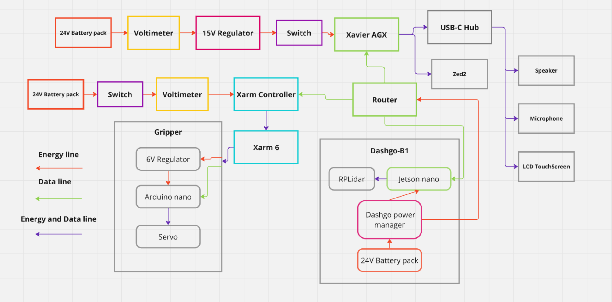

# Domestic Robot Electronics Documentation

## 1. Overview
- **Purpose**: @Home electronics documentation for the 2024 version.
- **Key Features**: 
    - **Differential-drive mobile base** for navigation.

    - **6-DOF (Degree of Freedom) robotic manipulator** for precise object handling.

    - **Human-Robot Interaction (HRI) peripherals** (touchscreen, microphone, speaker).

    - **Dual depth cameras** (Zed 2, Intel RealSense D435i) for grasp detections and obstacle avoidance.

    - **Network connection** using a 2.4Ghz Router.

- **System Block Diagram**: 
  

  

---

## 2. Electronics Components List
| Component          | Model/Part Number | Quantity | Description                          | Datasheet Link       |
|--------------------|-------------------|----------|--------------------------------------|----------------------|
| Computing Hardware    | Jetson AGX Xavier    | 1        | Main processing unit                 | [Link](https://siliconhighway.com/wp-content/gallery/jetson-agx-xavier-developer-kit-datasheet-us-811514-r5-web.pdf)            |
| Computing Hardware        | Jetson nano             | 1       | Navigation processing unit                  | [Link](https://developer.download.nvidia.com/assets/embedded/secure/jetson/Nano/docs/Jetson-Nano-System-On-Module-Data-Sheet-DA-09366-001_v1.2.pdf?__token__=exp=1738274456~hmac=3caffd1d3e7d9a33a83d3bb710c87b79470322557687cc5122a6aada32d1c68b&t=eyJscyI6ImdzZW8iLCJsc2QiOiJodHRwczovL3d3dy5nb29nbGUuY29tLyJ9)            |
| Vision camera     | Stereolabs ZED 2     | 1        | Vision main camera                   | [Link](https://www.mouser.com/datasheet/2/1520/ZED_2_Datasheet_v1_1-3498705.pdf)            |
| Differential mobile base  | EAI Dashgo B1           | 1        | Mobile base                   | [Link](https://eaibot.cn/download/1)            |
| Manipulator 6-DOF         | UF-Xarm6          | 1        |  Manipulation main component                      | [Link](http://download.ufactory.cc/xarm6/xArm%206%20User%20Manual_20190719.pdf)            |
| Xarm controller        | UFACTORY xArm DC Control Box   | 1        | xarm6 controller             | [Link](http://download.ufactory.cc/xarm/en/xArm%20User%20Manual.pdf?v=1578910898247)            |
| Lidar       | RPLidar A1   | 1        | Lidar for navigation             | [Link](https://www.generationrobots.com/media/rplidar-a1m8-360-degree-laser-scanner-development-kit-datasheet-1.pdf)            |
| USB-Hub       | USB-C hub Ugreen   | 1        | Usb-hub for xavier agx         | [Link](https://www.ugreen.com/collections/usb-c-hub/products/ugreen-4-in-1-usb-c-hub?variant=39915663196222)    |
| Audio card    |  Steren audo USB com-202   | 1        | Audio card for Agx     | [Link](https://descargas.steren.com.mx/COM-202-instr.pdf) 
| USB-Hub       | USB-C hub Ugreen   | 1        | Usb-hub for xavier agx         | [Link](https://www.ugreen.com/collections/usb-c-hub/products/ugreen-4-in-1-usb-c-hub?variant=39915663196222)    |
| Microphone   |  ReSpeaker_Mic_Array_v2.0 | 1        | Microphone for HRI     | [Link](https://wiki.seeedstudio.com/ReSpeaker_Mic_Array_v2.0/) 
| Speaker   |  Logitech speaker x100  | 1        | Speaker for HRI     | [Link](https://img.cartimex.com/v2/pdf/X100.pdf) 
| LCD Screen   | Joy it 7“ LCD TOUCHSCREEN | 1        | Lcd for HRI    | [Link](https://joy-it.net/files/files/Produkte/RB-LCD-7-3/RB-LCD-7-3_Datasheet_2021-12-09.pdf) 
| Gripper microcontroller | Arduino Nano | 1        | Gripper Microcontroller   | [Link](https://docs.arduino.cc/resources/datasheets/A000005-datasheet.pdf) 
| Voltage regulator  | LM2596 Variable voltage regulator | 1        | Gripper voltage regulator   | [Link](https://www.ti.com/lit/ds/symlink/lm2596.pdf) 
| Gripper servomotor | SERVOMOTOR MG996 16kg 180 degrees | 1        | Gripper servomotor  | [Link](https://www.electronicoscaldas.com/datasheet/MG996R_Tower-Pro.pdf) 
| Voltage Regulator | LB07 Step Down 15A | 1        | Xavier Agx Regulator | [Link](https://www.mpja.com/download/36625ps.pdf) 
| Voltimeter | Dual Digital Display DC Voltmeter & Ammeter 0-100V 0-10a | 2       | Battery voltimeter | [Link](https://curtocircuito.com.br/datasheet/modulo/voltimetro_e_amperimetro.pdf) 
| Electronic Switch | ON-OFF Switch KCD1-102| 2       | Battery voltimeter | [Link](https://www.handsontec.com/dataspecs/switches/KCD1-102-Rocker%20SW.pdf) 
| Li-ion Battery pack | SSCYHT 24v 20ah battery pack | 2       | Main power source | [Link](https://www.amazon.com.mx/SSCYHT-Bicicleta-el%C3%A9ctrica-Impermeable-Plegable/dp/B0CDRNM1PW/ref=sr_1_1?__mk_es_MX=%C3%85M%C3%85%C5%BD%C3%95%C3%91&s=electronics&sr=1-1) 

---

## 3. Power Management
### 3.1 Main Power Distribution
- **24V Battery Pack 1**  
  - **Components Powered**:  
    - Jetson AGX Xavier (via 15V LB07 regulator)  
        - USB-C Hub and peripherals (audio card, microphone, speaker, lcd)  
  - **Monitoring/Control**:  
    - Digital voltmeter/ammeter  
    - ON/OFF switch (KCD1-102)  

- **24V Battery Pack 2**  
  - **Components Powered**:  
    - xArm Controller
        - XArm 6  
            - Gripper
  - **Monitoring/Control**:  
    - Digital voltmeter/ammeter  
    - ON/OFF switch (KCD1-102) 

- **Dashgo Power Managment**  
  - **Components Powered**:  
    - Dashgo b1
    - Jetson nano 
    - Router
  - **Monitoring/Control**:  
    - Dashgo power management

### 3.2 Voltage Regulation
- **15V Regulator (LB07 Step Down)**  
  - Input: 24V (Battery Pack 1)  
  - Output: 15V  
  - Purpose: Powers Jetson AGX Xavier and USB peripherals  

- **6V Regulator (LM2596 Variable)**  
  - Input: 24V (Battery Pack 2 throught XArm controller)  
  - Output: 6V  
  - Purpose: Supplies Arduino nano and Servo

### 3.3 Power Monitoring & Safety
- **Dual Digital Voltmeters/Ammeters**: Real-time voltage tracking  
- **Dashgo Power Manager**: Stable power distribution to Dashgo B1/RPLidar  

### 3.4 Energy and Data Lines
- **Energy Line**: Combines different connections with generic cable
- **Data Line**: Connects sensors (lidar, cameras) via USB

---

## 4. Network Architecture
- **2.4GHz Router**: Central hub connecting:  
  - Jetson AGX Xavier (main compute)  
  - Jetson Nano (navigation)  
  - xArm Controller  

---

## 6. Safety and Compliance
- **Electrical Safety**: To be implemented.  
- **Emergency Stop**: Emergency xArm controller button and dashgo b1
- **Thermal Management**: Passive cooling  

---

## 10. Troubleshooting
| Symptom               | Possible Cause          | Solution                     |
|-----------------------|-------------------------|------------------------------|
| Bad cable management   | Different color standar    | Set electric standar      |
| Low bandwith     | Bad router                | Change Router           |
| Security problems          | Unstable power security   | Add safety components     |

---

## 11. Compliance and Standards
- **EMC**: To be added
- **Safety**: To be added

---

## Appendix
- **References**: Roborregos-docs
- **Revision History**:  
  | Version | Date       | Changes Made           |
  |---------|------------|------------------------|
  | 1.0     | 2025-30-01 | Initial release        |